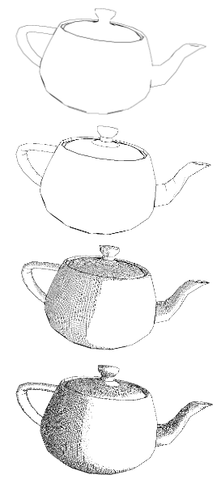

# Non-Photorealistic Rendering: Exploring Cel-Shading and Pen-and-Ink Illustration

This project explores non-photorealistic rendering (NPR) techniques, specifically focusing on implementing cel-shading and pen-and-ink illustration algorithms from scratch.

Implemented Algorithms
----------------------

### Sobel Edge Detection

*   Post-render edge detection using Sobel Operator on depth values.
*   Produces outlines by comparing z-buffer values instead of color.

### First and Second Order Sobel

*   Distinguishes internal and external edges using first and second-order operators.
*   Captures abrupt and subtle depth changes within the model.

### Sobel with Normalization

*   Normalizes gradients to improve edge distinction.
*   Enhances accuracy and reduces artifacts in edge detection.

### Cross-Hatching and Stippling Techniques

*   Utilizes luminance-based cross-hatching and stippling for artistic rendering.
*   Adjusts line frequency based on luminance, enhancing visual aesthetics.

### Cel-Shading

*   Implements cartoon-like shading by refining lighting techniques.
*   Focuses on ambient lighting and scene illumination for a cel-shaded effect.

References
----------

*   Freeman, H., & Serger, O. (1990). Generalized and separable sobel operators.
*   Saito, T., & Takahashi, T. (1990). Comprehensible Rendering of 3-D Shapes.
*   Parameter Values for the HDTV Standards for Production and International Programme Exchange: Recommendation ITU-R Bt. 709-5.
*   Decaudin, P. (1996). Cartoon-Looking Rendering of 3D Scenes.
